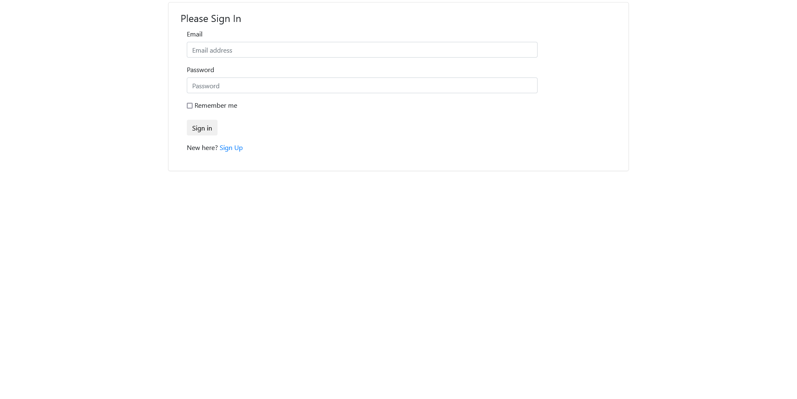
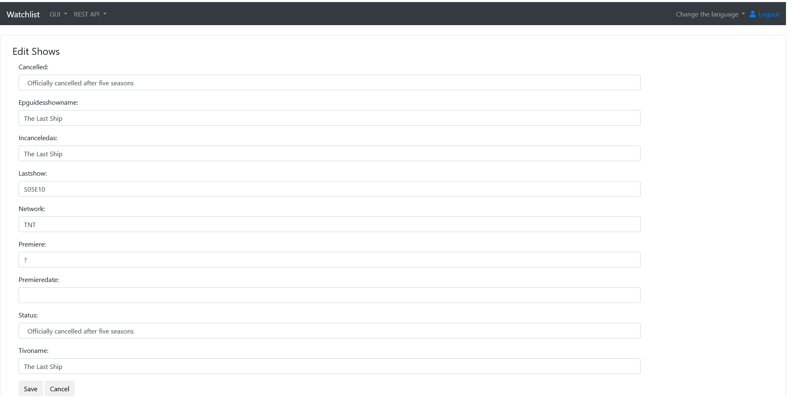
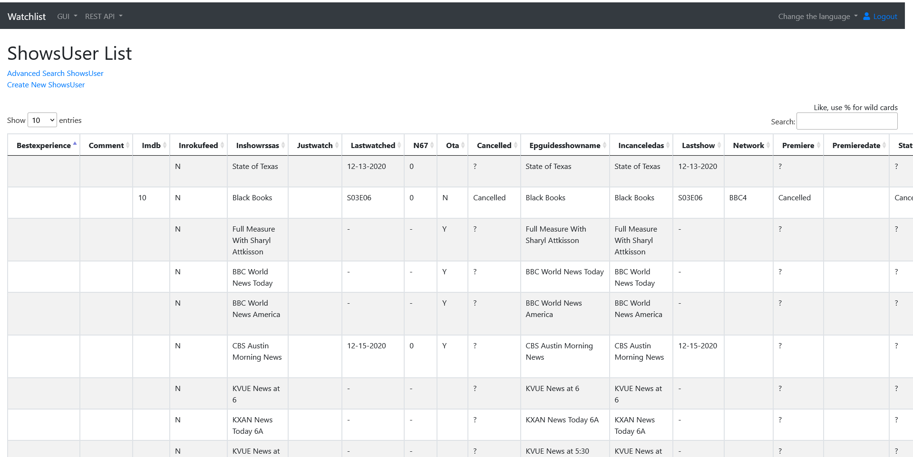
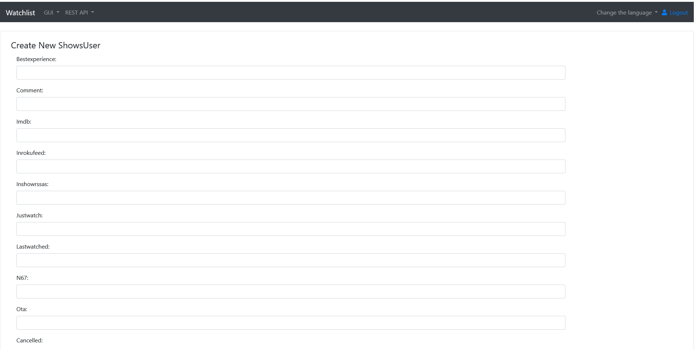
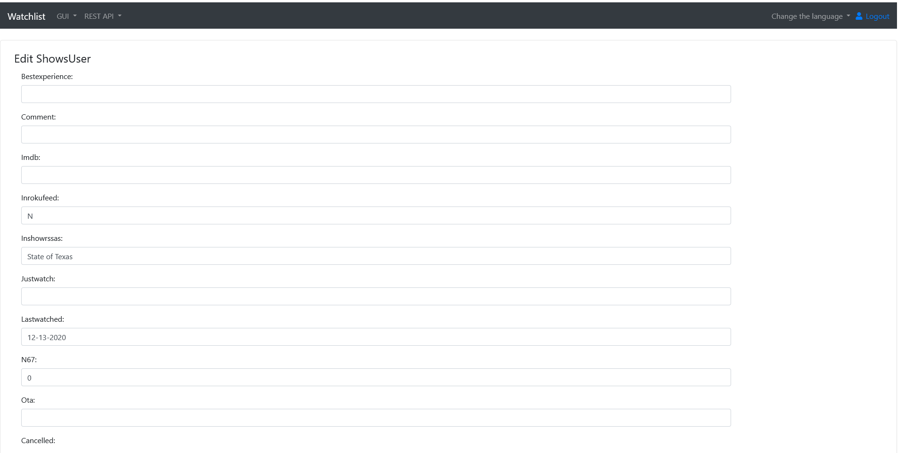

# Watchlist
An application for tracking the show you want to watch. 

[Files list](files.md)

## Screen shots
### Common screens

Login screen

English home screen

German home screen

French home screen

### Admin screens
#### Account screens
Account list screen

Account new screen

Account edit screen

### User screens
#### Networks screens
Networks list screen

Networks new screen

Networks edit screen

#### Shows screens
Shows list screen

Shows new screen

Shows edit screen

#### Roamiosp screens
Roamiosp list screen

Roamiosp new screen

Roamiosp edit screen

#### ShowsUser screens
ShowsUser list screen

ShowsUser new screen

ShowsUser edit screen

#### Cablecard screens
Cablecard list screen

Cablecard new screen

Cablecard edit screen

#### Ota screens
Ota list screen

Ota new screen

Ota edit screen

#### Roamionpl screens
Roamionpl list screen

Roamionpl new screen

Roamionpl edit screen

#### NetworksUser screens
NetworksUser list screen

NetworksUser new screen

NetworksUser edit screen

#### Roamiotodo screens
Roamiotodo list screen

Roamiotodo new screen

Roamiotodo edit screen

