# Watchlist
An application for tracking the show you want to watch. 

[Files list](files.md)

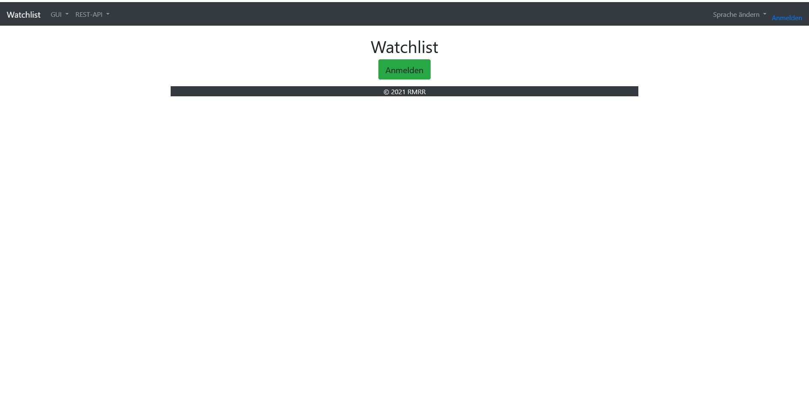

### Admin screens
#### Account screens
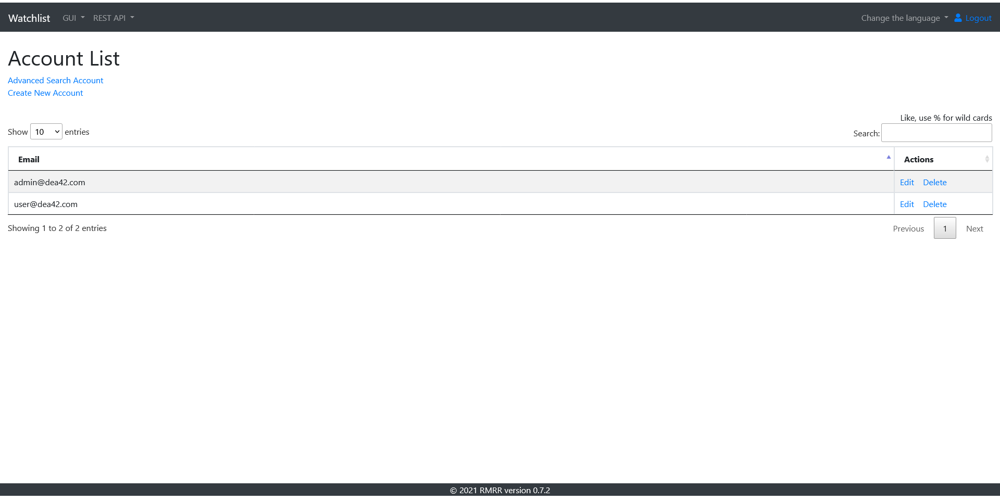

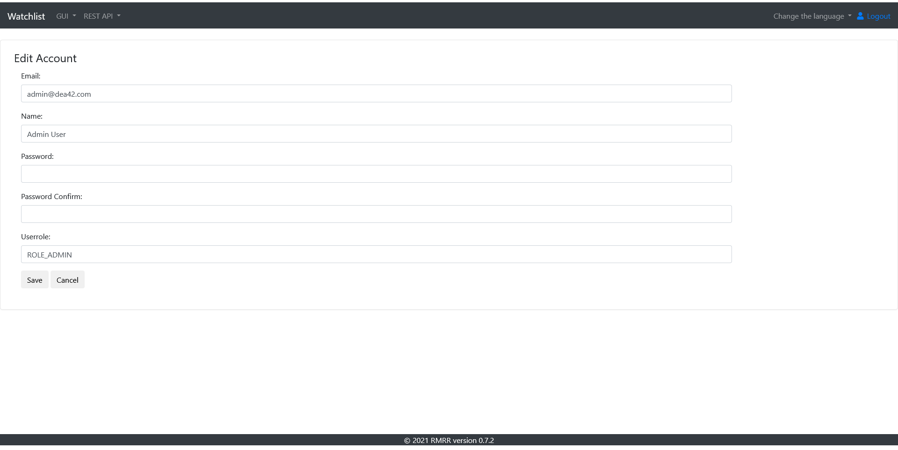

#### Networks screens
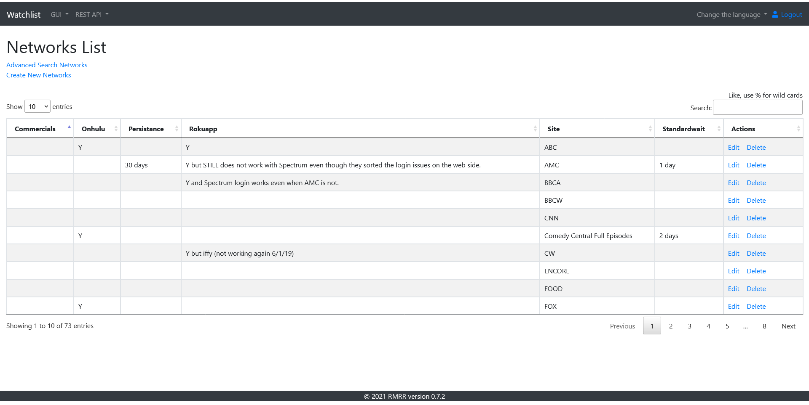

#### Shows screens
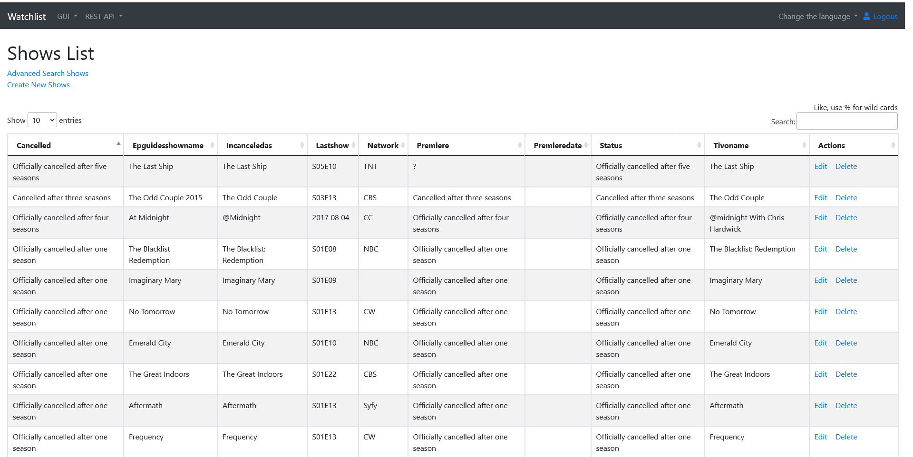
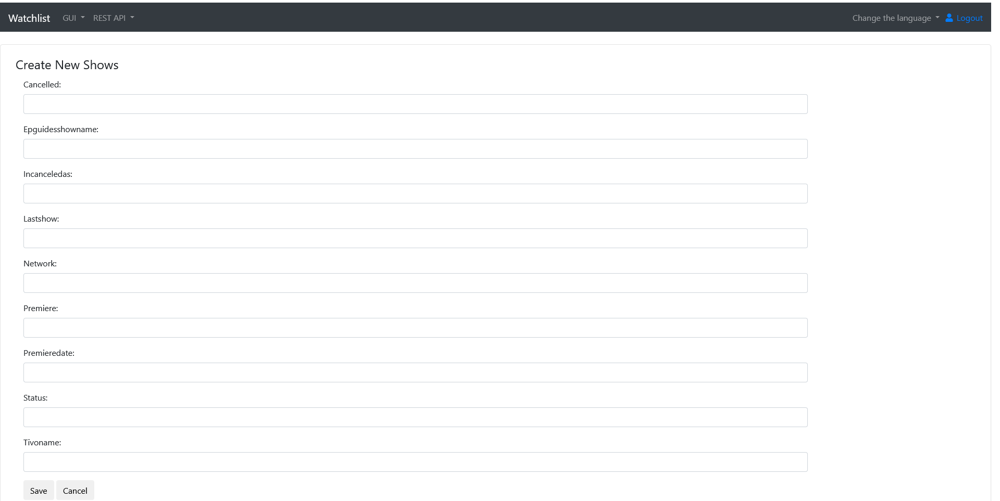

### User screens
#### Roamiosp screens
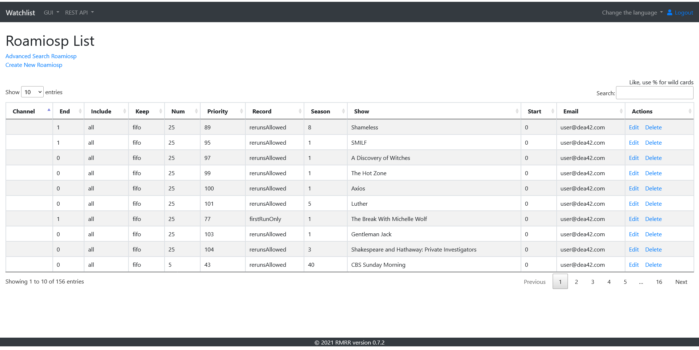

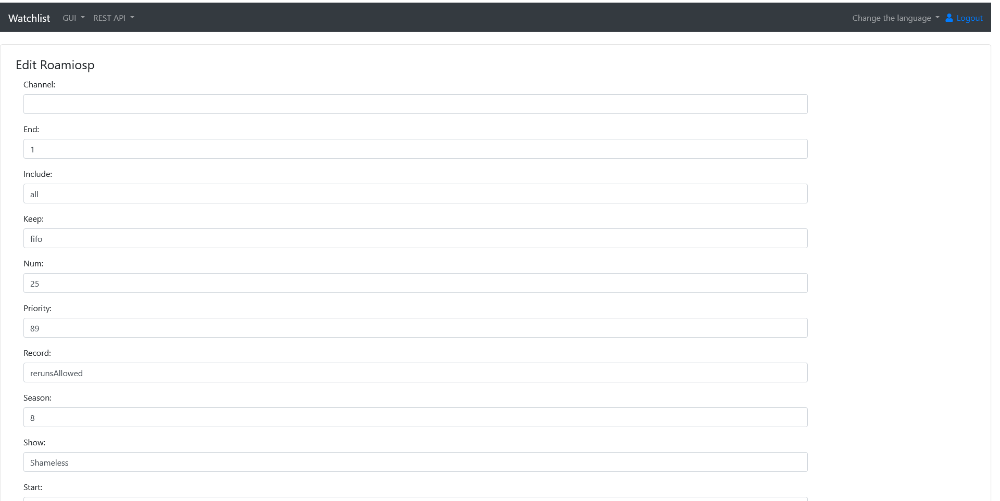

#### Showsuser screens

#### Cablecard screens

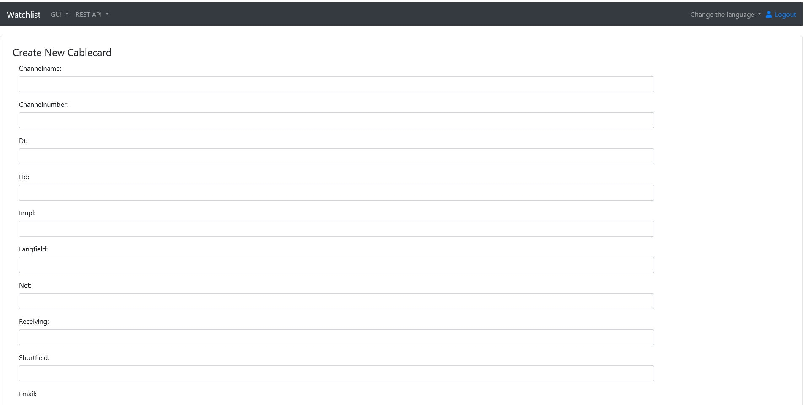
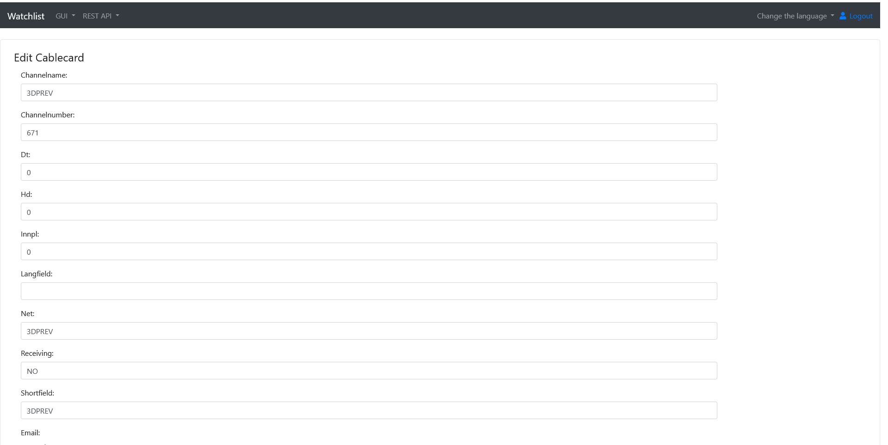

#### Networksuser screens

#### Roamionpl screens

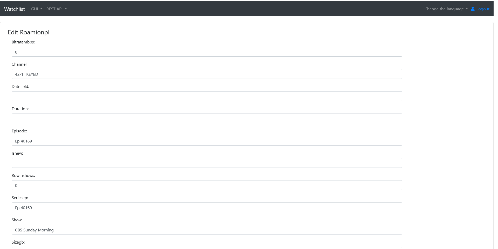

#### Ota screens
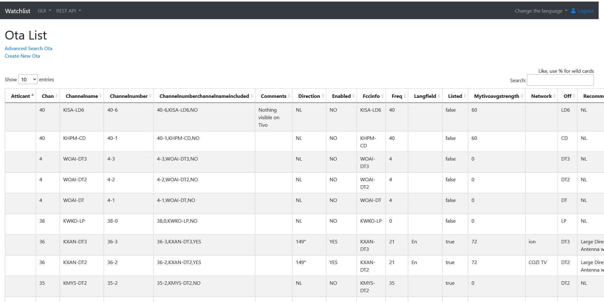

#### Roamiotodo screens

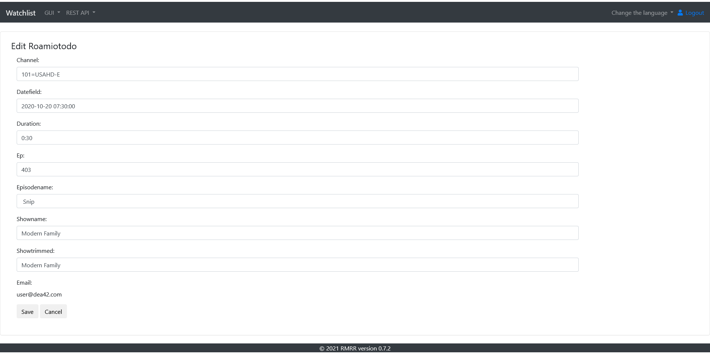

